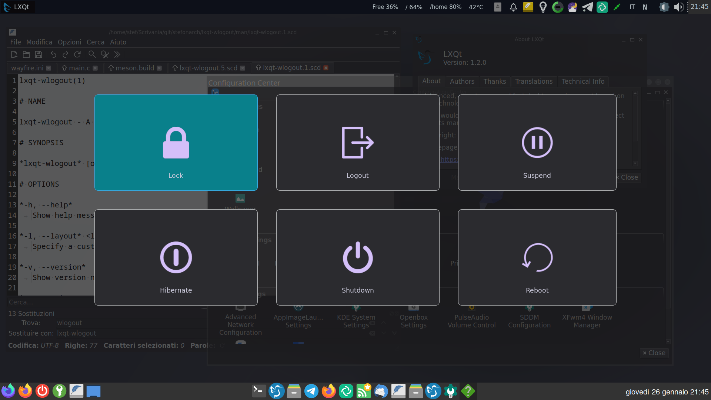

# lxqt-wlogout

> lxqt-wlogout is a logout menu for [wayland](https://wayland.freedesktop.org/) environments which exits a running LXQt-session. It is a simple fork of [wlogout](https://github.com/ArtsyMacaw/wlogout) and can be installed alongside.
## Running
Run `lxqt-lxqt-wlogout` to launch and press `Escape` to exit.
## Config
If you editing the default layout and css file it is recommended that you copy `/etc/lxqt-wlogout/layout` and `/etc/lxqt-wlogout/style.css` to `~/.config/lxqt/lxqt-wlogout/` or to `~/.config/lxqt-wlogout/` and change them there.
### Layout
Custom buttons can be defined and edited in a layout file. The format is as follows:
```
{
    "label" : "CSS Label",
    "action" : "command to execute when clicked",
    "text" : "text displayed on button",
    "keybind" : "character to be bound"
}
```
Check the default [layout file](layout) for examples and run `man 5 lxqt-wlogout` for documentation.
### Style
lxqt-wlogout can be easily styled through the style.css file; If you would like to style a button use the label given to it in the layout file, and for other styling refer to the [GTK Manual](https://developer.gnome.org/gtk3/stable/chap-css-properties.html) which shows all the allowed css.
## Install

### Compiling from Source
Install dependencies:
* GTK+
* GObject introspection
* meson
* gtk-layer-shell (optional: transperancy)
* scdoc (optional: man pages)
* systemd (optional: default buttons)
* swaylock (optional: default buttons)

Run these commands:
```
git clone https://github.com/stefonarch/lxqt-wlogout
cd lxqt-wlogout
meson build
ninja -C build
sudo ninja -C build install
```
## License
lxqt-wlogout is licensed under MIT. [Refer to LICENSE for more information](LICENSE)
